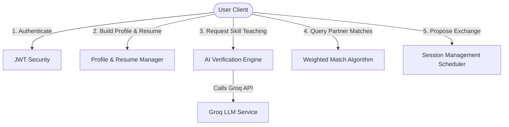

# 🔄 SkillSwap: Peer-to-Peer Learning & Skill Exchange Platform

SkillSwap is a comprehensive, full-stack application designed to facilitate peer-to-peer knowledge exchange. The platform enables users to list skills they want to teach and learn, dynamically tests and verifies their teaching capability using Groq AI, and matches compatible users for collaborative learning sessions.

---

## 📁 Repository Structure

The project is split into two main components:

| Component | Directory | Technology Stack | Description |
| :--- | :--- | :--- | :--- |
| **Backend API** | [`SkillSwap-Server`](file:///Users/shantanukale/testing/SkillSwap-Server) | Java, Spring Boot, PostgreSQL, Hibernate, Groq AI | Handles users, authentication, profile metadata, resume compilation, AI quiz generation, match calculations, and session tracking. |
| **Frontend UI** | [`SkillSwap-UI`](file:///Users/shantanukale/testing/SkillSwap-UI) | React, Vite, TypeScript, Tailwind CSS, shadcn-ui | Fully responsive interactive client dashboard, matchmaking browser, testing/examination interface, session requests, and interactive user settings. |

---

## 🚀 Key Features

*   **🔒 Secure JWT Authentication**: Robust registration and login workflow.
*   **📄 Portfolio/Resume Builder**: Compile experience, credentials, and coding stats (LeetCode/GitHub).
*   **🧠 AI-Powered Skill Verification**: Auto-generates multi-tier skill verification tests using **Groq AI**. Users *must* pass a test before listing a skill for teaching.
*   **🎯 Smart Matching Engine**: Analyzes and recommends swap partners using a weighted matching algorithm (checks skill overlap, compatibility, tests passed, and availability).
*   **📅 Session Management**: Facilitates session requests, acceptance, scheduling, and lifecycle states (Pending ➔ Scheduled ➔ Completed).

---

## 🛠️ Getting Started & Setup

### Prerequisites
- **Java Development Kit (JDK) 17+**
- **Node.js & npm** (v18+ recommended)
- **PostgreSQL** database running locally or remotely

---

### 1. Backend Setup (`SkillSwap-Server`)

1. Navigate to the backend directory:
   ```bash
   cd SkillSwap-Server
   ```
2. Configure your PostgreSQL credentials and API keys in [`application.properties`](file:///Users/shantanukale/testing/SkillSwap-Server/src/main/resources/application.properties):
   ```properties
   spring.datasource.url=jdbc:postgresql://localhost:5432/skillswap
   spring.datasource.username=your_user
   spring.datasource.password=your_password
   
   # Groq API for test generation
   groq.api.key=YOUR_GROQ_API_KEY
   ```
3. Run the server using the Maven wrapper:
   ```bash
   ./mvnw spring-boot:run
   ```
   The server will start up on **port 8080** (Base URL: `http://localhost:8080`).

---

### 2. Frontend Setup (`SkillSwap-UI`)

1. Navigate to the frontend directory:
   ```bash
   cd SkillSwap-UI
   ```
2. Install dependencies:
   ```bash
   npm install
   ```
3. Run the client development server:
   ```bash
   npm run dev
   ```
   The client will be running on **http://localhost:5173**.

---

## 🌐 System Architecture & Flow



### Endpoints & Docs Overview

For detailed API definitions, request payloads, and testing instructions, consult:
- 📄 **[Postman API Documentation PDF](file:///Users/shantanukale/testing/SkillSwap-Server/SkillSwap%20Postman%20API%20Documentation.pdf)**
- 🧪 **[Frontend Testing Guide](file:///Users/shantanukale/testing/SkillSwap-UI/FRONTEND_TESTING_GUIDE.md)**
- 🖥️ **[UI Layout README](file:///Users/shantanukale/testing/SkillSwap-UI/README.md)**
- ⚙️ **[Backend API README](file:///Users/shantanukale/testing/SkillSwap-Server/README.md)**
